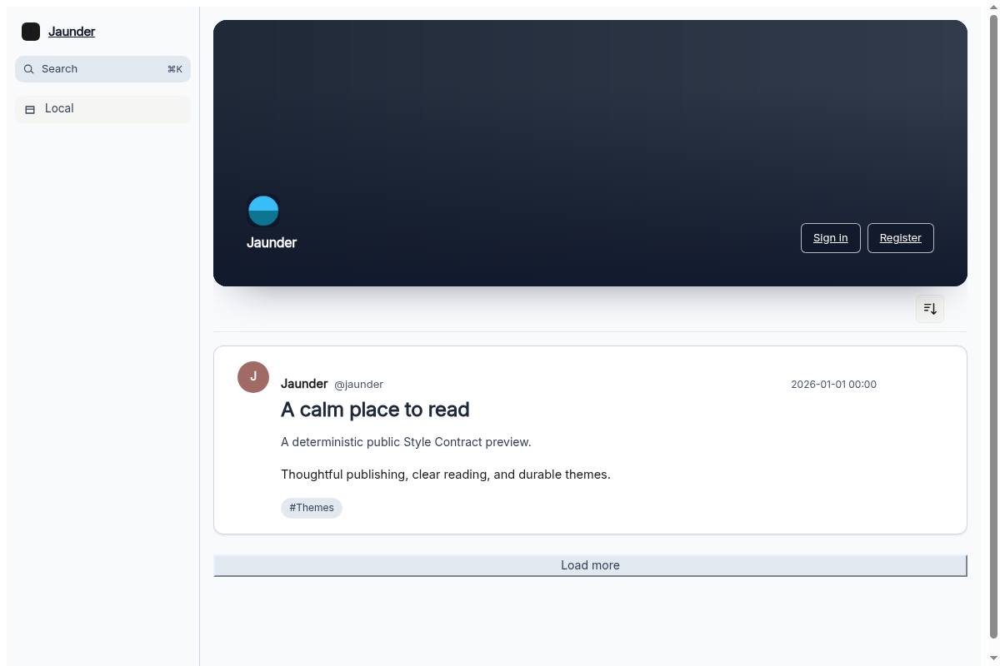
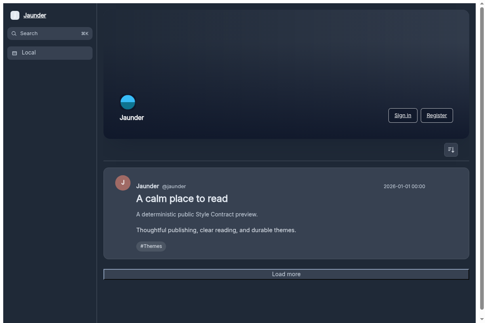

# Tailwind

An independent MIT Jaunder Theme Package inspired by the visual language of
[`tomowang/hugo-theme-tailwind`](https://github.com/tomowang/hugo-theme-tailwind)
at `d6841f6c9d53155a3245d6472555860f7acb1cd0`. It is not a Hugo theme, fork, or
sync-compatible derivative. See [NOTICE](NOTICE) for the preserved upstream MIT
notice, [ASSET-PROVENANCE.md](ASSET-PROVENANCE.md) for package asset licenses, and
[initial-port verification](docs/initial-port-verification.json) for the retained pre-palette verification baseline.

The theme uses only Jaunder Style Contract 1 semantic hooks. Its responsive
centered shell, slate/gray system-dark palette, cards, prose/code treatment,
navigation, and visible focus styling are generated from pinned Tailwind source.
It contains no templates, JavaScript, SVG, external runtime resource, wrapper
selector, or `anchor-name` declaration.

## Previews

The canonical light thumbnail required by Jaunder and its maintained dark-mode
companion are both 1200×800 PNGs generated from the pinned Jaunder thumbnail
fixture:

| Light (`preview.png`)                        | Dark (`preview-dark.png`)                        |
| -------------------------------------------- | ------------------------------------------------ |
|  |  |

`preview.png` is the canonical package input checked by Jaunder's reusable
workflow. `preview-dark.png` is repository documentation for the same fixture
with `prefers-color-scheme: dark`; it is intentionally outside the package
format and the reusable workflow's light-thumbnail comparison boundary.

## Upstream references

The retained comparison references are [the upstream README screenshot](docs/upstream/upstream-readme-screenshot.png), [rendered list/home](docs/upstream/upstream-rendered-home-list-1440x900.png), and [rendered single Post](docs/upstream/upstream-rendered-single-post-1440x900.png). Their source URLs, fixed upstream ref, and SHA-256 digests are recorded in [the verification record](docs/initial-port-verification.json). They document visual inspiration, not pixel identity or a source dependency.

## Compatibility

Tailwind Theme v1 requires Jaunder 1.0.0 or later. Theme Package schema 1 and
Style Contract 1 were introduced in Jaunder 1.0.0; those manifest values are the
machine-readable compatibility markers. The Theme's SemVer tag identifies its
distribution release rather than a separate Jaunder compatibility axis.

## Repository layout

`theme.json`, generated root `style.css`, and declared `assets/` are the only
package inputs. `src/`, docs, and workflow files are maintenance support files.
`style.css` is committed portable source-of-truth output.

The editable `src/theme.css` is deliberately formatted rather than minified.
Its semantic-hook sections are ordered by `data-jaunder-part` name so authors
can find one contract concept without tracing generated CSS. Generation alone
minifies the committed `style.css` artifact.

The pinned Tailwind authoring dependency and `package-lock.json` are retained
intentionally as ADR-0197's preprocessor proving ground, even though this
package does not need Tailwind utilities today. The CLI is the reproducible,
locked authoring pipeline that turns the readable source into the portable CSS
artifact; it must not inject a generic reset or selectors outside the Theme
Package selector boundary.

## Versioning

Stable releases use immutable `vMAJOR.MINOR.PATCH` tags. The tag and GitHub
release identify the Theme release; `theme.json`'s `schema` and
`style_contract` identify Jaunder compatibility contracts instead. See
[VERSIONING.md](VERSIONING.md) for the SemVer policy and why schema 1 does not
carry a release-version field.

## Maintain

Use the locked dependency graph and repository-local binary; do not use `npx`:

```sh
npm ci --ignore-scripts
./node_modules/.bin/tailwindcss --input src/theme.css --output style.css --minify
node scripts/check-drift.mjs
node scripts/check-dark-divider-contract.mjs
node scripts/check-continuation-contract.mjs
node scripts/check-upstream-palette-contract.mjs
"$JAUNDER_BIN" theme check .
"$JAUNDER_BIN" theme thumbnail . --browser "$JAUNDER_THEME_THUMBNAIL_BROWSER" --output preview.png
./scripts/generate-dark-preview.sh
file preview.png preview-dark.png
```

Use the bare pinned executables supplied by Jaunder's `theme-thumbnail`
environment: set `JAUNDER_BIN` to that environment's pinned `jaunder` binary
and `JAUNDER_THEME_THUMBNAIL_BROWSER` to its pinned Chromium binary. The dark
script is deterministic: it creates a temporary valid package whose generated
dark media block always applies, invokes that same browser, and writes only
`preview-dark.png`. The reusable workflow owns validation and the byte-for-byte
light `preview.png` comparison; this repository-owned command
is the explicit maintenance boundary for the dark documentation preview.

`check:drift` regenerates to a temporary file and byte-compares it with the
committed `style.css`, failing without mutating the working tree when they differ.
The local check is Jaunder's canonical validator, not a copied validator.

Before releasing, import the generated ZIP through Theme Studio and check Local,
author, tag, and permalink routes in light and dark modes. Include wide, 390px,
and 320px layouts; keyboard focus; 200% zoom; reduced motion; long content; and
an authenticated Post Actions menu. This is presentation review, not another
package format or repository-specific test harness.

## Optional semantic hooks

Optional Style Contract hooks must receive defensive cosmetic styling only: do not make layout, sizing, positioning, or sibling relationships depend on their presence. This theme treats `avatar`, `author-handle`, and `source-attribution` that way; structural layout is rooted in required semantic hooks. Keep selectors rooted at documented `data-jaunder-part` hooks and outside trusted controls.

## Replace the packaged images

The package defaults use `assets/tailwind-logo.png`, `assets/header-slate.png`,
and `assets/header-dawn.png`. To publish different portable defaults, replace
those files at the same paths, update [ASSET-PROVENANCE.md](ASSET-PROVENANCE.md)
and any required notices, then regenerate the preview and validate the package.
Keeping the paths stable avoids an unnecessary manifest edit.

Per-site Media bindings are intentionally not package inputs: they belong to one
Jaunder installation and are excluded from exported ZIPs. Theme Studio can bind
an owned-Media logo and owned-Media entries in a header pool alongside package
assets. Use those presentation controls to personalize one installation; use
replaced package assets when the portable package defaults themselves must
change. Neither option changes Theme Package schema 1.

## Install a release

Download `theme-package.zip` from the desired versioned GitHub release, then in
Jaunder open **Themes**:
import ZIP → preview the private draft → publish → explicitly select the
published Theme. Importing does not alter public pages; only explicit selection
does. Do not use repository support files as import input.

## Previous verification baseline

Presentation source `8831fb7f912948e0b7f60b33f2af1397e1c423f1`, canonical workflow
[35618737141](https://github.com/jaunder-org/theme-tailwind/actions/runs/35618737141),
package SHA-256
`ecb481c62a4a53a3ab5dda1a7f5c138b234433e7edd59becd581f1583c9de30e`, and
preview SHA-256 values
`b9708fbbbdaf9a0a77900995c4e637ed7e16f4c1f76a0d05d86642f4936ed6bb` and
`5ccf0963c755dcaf0111145334772532a95816b89b5fee94075f1044ff7a50d1`
record the completed pre-palette proving-ground pass. They are retained as
initial-port history, not asserted as current package or release evidence. The
verification record will be replaced with the palette revision's canonical
workflow facts before release.

## Automation

The caller workflow runs clean install, generation, and drift checking before it
calls Jaunder's pinned canonical reusable workflow. That workflow validates,
creates the canonical `preview.png`, and packages the deterministic ZIP; the ZIP
is generated/uploaded and is never committed.
